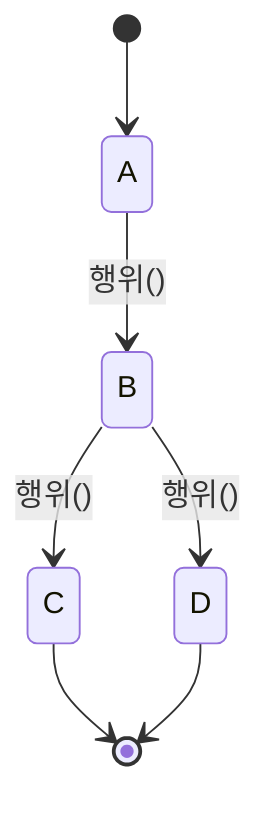
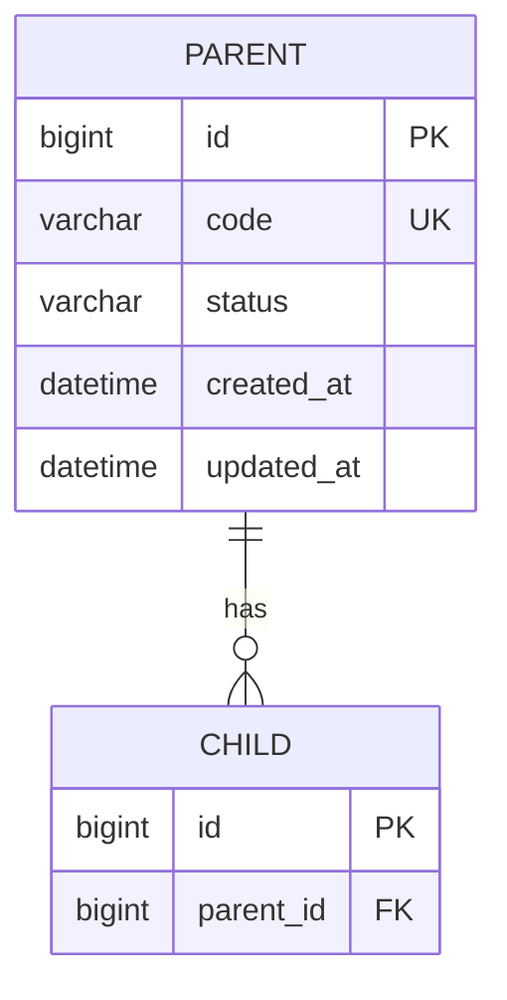
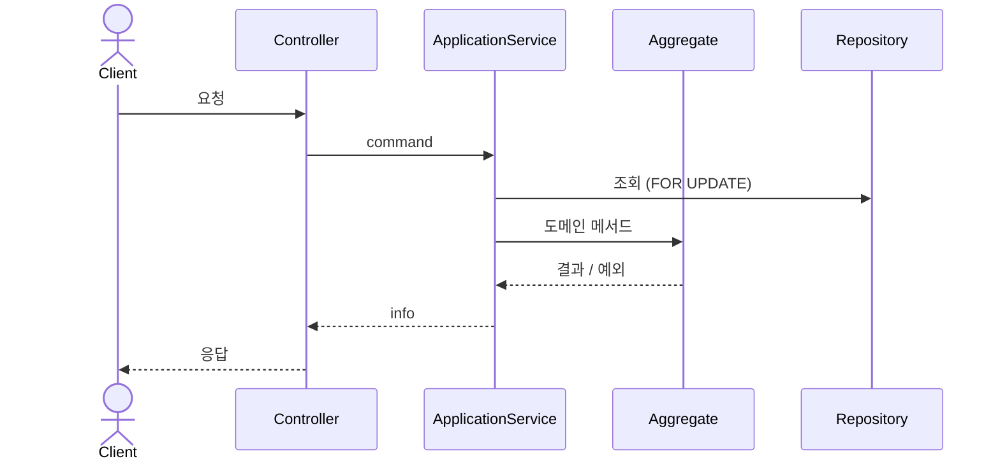

# 도메인 모델링

> 요구사항([01-requirements.md](01-requirements.md))을 옮긴다.
> - 도메인
> - 테이블
> - 동시성 전략
>
> 여기서 정한 이름은 코드에서 **그대로** 쓴다.

---

## 1. 용어 · 네이밍 (고정)

<!--
원문의 비즈니스 용어와 코드 이름을 1:1로 고정한다.
구현 중 임의로 바꾸지 않는다.
-->

| 비즈니스 용어 | 코드 이름 | 설명 |
|---|---|---|
| | | |

**Enum 값**

| Enum | 값 | 설명 |
|---|---|---|
| `XxxStatus` | `A` / `B` / `C` | |

**식별자 형식**
- 예: 주문번호 `OD-{yyyyMMdd}-{id}`

---

## 2. 도메인 분해

<!--
도메인 = 패키지.
애그리거트 간에는 객체가 아니라 식별자로 참조한다.
-->

| 도메인(패키지) | 애그리거트 루트 | 하위 엔티티 · VO | 책임 | 관련 FR |
|---|---|---|---|---|
| | | | | |
| `common` | — | 공유 VO·Enum | 여러 도메인이 같이 쓰는 값 | — |

---

## 3. 애그리거트 상세

<!-- 애그리거트 하나당 아래 블록을 복사한다 -->

### 3.1 `{Aggregate}`

**주요 속성**
- `id`
- 

**행위 (도메인 메서드)**

| 메서드 | 하는 일 | 실패 시 | 관련 FR |
|---|---|---|---|
| `create(...)` | | `ErrorCode.XXX` | |

**불변식** (서비스의 if문이 아니라 이 애그리거트가 스스로 지킨다)
- 
- 

---

## 4. 상태 전이

| 현재 | 다음 | 트리거 | 조건 | 위반 시 |
|---|---|---|---|---|
| A | B | | | `INVALID_STATUS_TRANSITION` |

- 역전이·종결 상태 재처리는 허용하지 않는다

---

## 5. 도메인 서비스 · 정책

<!--
아래만 적는다.
- 여러 애그리거트를 넘나드는 로직
- 규칙이 여러 개로 갈리는 정책 (다형성 후보)
-->

| 이름 | 위치 | 하는 일 | 관련 FR |
|---|---|---|---|
| | | | |

---

## 6. ERD

**제약 · 인덱스**

<!--
ddl-auto는 엔티티 기준으로 스키마를 만든다.
여기 적은 제약·인덱스는 반드시 엔티티에 선언한다.
- @Table(uniqueConstraints, indexes)
- @Column(nullable = false)
- 선언하지 않으면 DB에 존재하지 않는다.
비관적 락(FOR UPDATE) 조회 조건 컬럼에는 인덱스가 필수다.
- 없으면 스캔한 모든 행이 잠긴다.
-->

| 테이블 | 종류 | 컬럼 | 이유 |
|---|---|---|---|
| | UNIQUE | | 중복 방지 (NFR-) |
| | INDEX | | 락 조회 조건 / 조회 성능 |
| | NOT NULL | | |

---

## 7. 동시성 · 정합성 지점

<!--
01의 NFR을 구체적인 경합 지점으로 내린다.
지점마다 동시성 TC가 있어야 한다.
-->

| 지점 | 경합 시나리오 | 제어 방식 | 트랜잭션 경계 | 검증 |
|---|---|---|---|---|
| | 같은 요청 동시 N건 | UNIQUE 제약 + 충돌 시 기존 결과 반환 | | TC- |
| | 같은 자원 동시 갱신 | 비관적 락 / 조건부 UPDATE / `@Version` | | TC- |

**선택 근거**
- 

---

## 8. 핵심 흐름 (선택)

<!-- 락·트랜잭션·외부 I/O가 얽혀 말로 설명하기 어려운 흐름 1~2개만 그린다 -->

---

## 9. 기초 데이터 (seed)

<!--
원문의 기초 데이터 표를 그대로 옮긴다.
data.sql과 한 행씩 대조한다.
임의로 값을 바꾸지 않는다.
- 테스트 편의로 바꾸고 싶으면 테스트 전용 fixture를 만든다.
-->

| 테이블 | 원문 행 수 | data.sql 행 수 | 대조 완료 |
|---|---|---|---|
| | | | [ ] |
