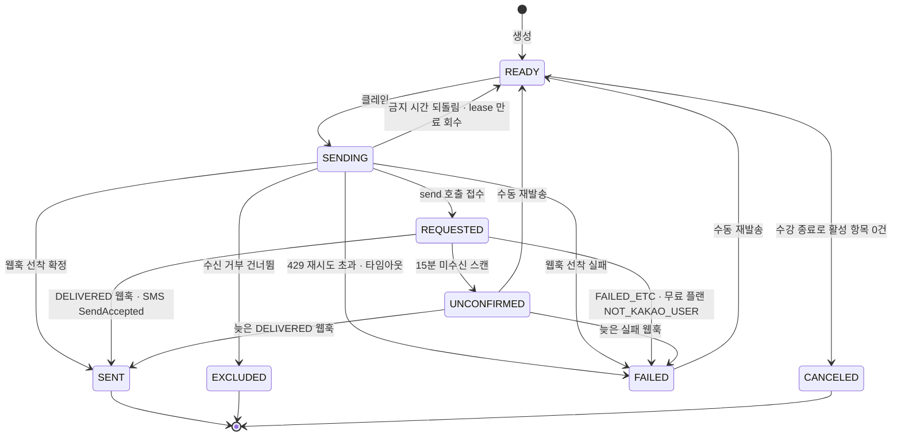
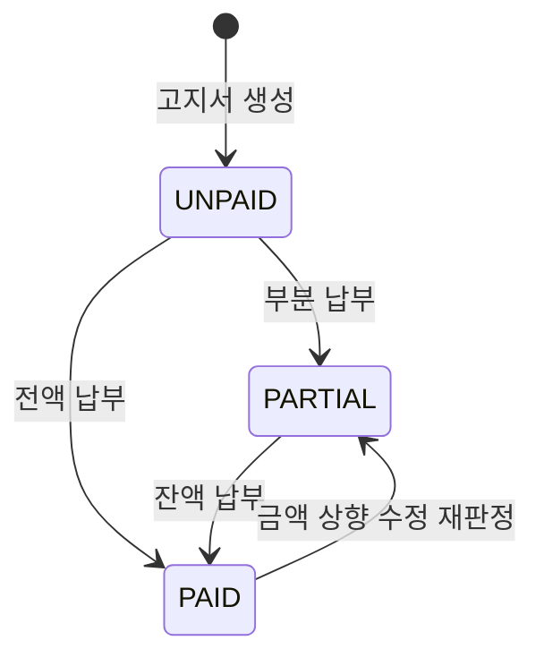
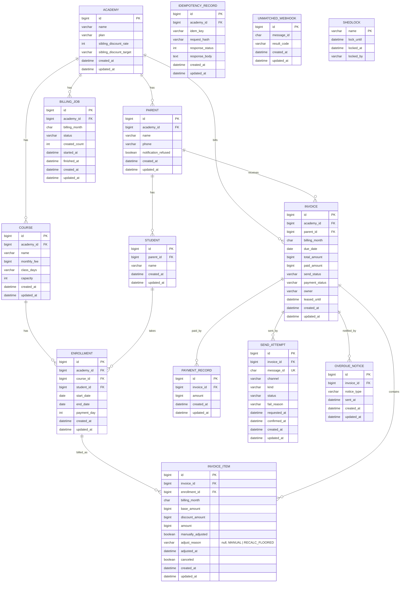
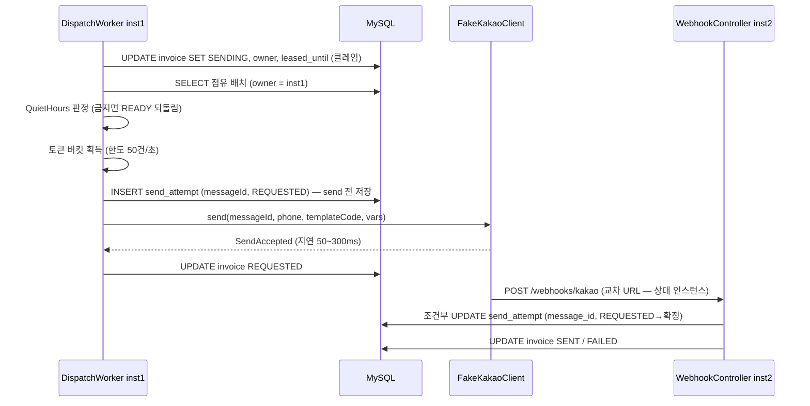

# 도메인 모델링

> 요구사항([01-requirements.md](01-requirements.md))을 옮긴다.
> - 도메인
> - 테이블
> - 동시성 전략
>
> 여기서 정한 이름은 코드에서 **그대로** 쓴다.

---

## 1. 용어 · 네이밍 (고정)

| 비즈니스 용어 | 코드 이름 | 설명 |
|---|---|---|
| 학원 | `Academy` | 요청 헤더 `X-Academy-Id`로 식별 (FR-2.1) |
| 플랜 | `AcademyPlan` | 유료 · 무료 (FR-5.9) |
| 형제 할인 설정 | `siblingDiscountRate` · `siblingDiscountTarget` | 학원별 설정값 (D-5) |
| 학부모 | `Parent` | 전화번호 · 수신 거부 내장 (D-6) |
| 수신 거부 | `notificationRefused` | 학부모 속성 (FR-4.7) |
| 수강생 | `Student` | 학부모 참조로 형제 판별 (D-4) |
| 강좌 | `Course` | 강좌명 · 월 원비 · 수업 요일 · 정원 |
| 월 원비 | `monthlyFee` (`Money`) | 원 단위 정수 |
| 수업 요일 | `ClassDays` | 요일 집합 VO, 빈 집합 불가 |
| 정원 | `capacity` | 1 이상 |
| 수강 등록 | `Enrollment` | 강좌 · 수강생 · 기간 · 납부일 |
| 수강 기간 | `EnrollmentPeriod` | 시작일 · 종료일(null = 무기한) |
| 납부일 | `PaymentDay` | 1~31, 결손 월은 말일로 당김 (D-7) |
| 고지서 | `Invoice` | 학부모 1명 · 1개월 1장 (D-1) |
| 고지 항목 | `InvoiceItem` | 수강 등록별 산정 금액 |
| 고지 월 | `BillingMonth` | `yyyy-MM` 문자열 VO |
| 납부기한 | `dueDate` | 고지 월의 납부일 (D-8) |
| 발송 상태 | `InvoiceSendStatus` | 고지서 발송 축 (D-11) |
| 납부 상태 | `PaymentStatus` | 고지서 납부 축 (FR-3.16) |
| 납부 기록 | `PaymentRecord` | 건별 기록, 합산 판정 (FR-6.2) |
| 멱등 기록 | `IdempotencyRecord` | 키 · 본문 해시 · 첫 응답 (D-22) |
| 발송 작업 | `BillingJob` | (월, 학원) 단위 (D-13) |
| 발송 이력 · 발송 시도 | `SendAttempt` | 시도 단위, 채널 · 사유 포함 (D-11) |
| messageId | `messageId` | UUID, 호출자 생성 (D-31) |
| 결과 코드 | `WebhookResultCode` | 웹훅의 세 코드 (FR-5.3) |
| 실패 사유 | `FailReason` | 실패 필터 사유 (FR-7.2) |
| 발송 금지 시간대 | `QuietHours` | 21:00~08:00 판정 (D-10) |
| 미납 안내 | `OverdueNotice` | (고지서, 시점) 1회 기록 (D-28) |
| 미매칭 웹훅 기록 | `UnmatchedWebhook` | messageId 미매칭 기록 (TC-5-10) |
| 연체일수 | `overdueDays` | 기준일 − 납부기한 (D-29) |
| 기준일 | `baseDate` | 미납 목록 조회 파라미터 |

**Enum 값**

| Enum | 값 | 설명 |
|---|---|---|
| `AcademyPlan` | `FREE` / `PAID` | SMS 대체는 `PAID`만 (FR-5.8) |
| `SiblingDiscountTarget` | `FROM_SECOND` / `ALL` | 둘째부터 / 형제 전원 (D-5) |
| `InvoiceSendStatus` | `READY` / `SENDING` / `REQUESTED` / `SENT` / `FAILED` / `UNCONFIRMED` / `EXCLUDED` / `CANCELED` | D-11 단순 세트 + 취소 종결 |
| `PaymentStatus` | `UNPAID` / `PARTIAL` / `PAID` | 합산액 기준 (FR-6.3) |
| `SendChannel` | `KAKAO` / `SMS` | 이력에 채널 기록 (NFR-13) |
| `SendKind` | `INITIAL` / `RESEND` / `SMS_FALLBACK` / `OVERDUE_NOTICE` | 시도의 종류 |
| `SendAttemptStatus` | `PENDING` / `REQUESTED` / `SUCCEEDED` / `FAILED` / `UNCONFIRMED` | `PENDING`은 금지 시간 보류 SMS (D-9) |
| `FailReason` | `RATE_LIMITED` / `TIMEOUT` / `FAILED_NOT_KAKAO_USER` / `FAILED_ETC` / `UNCONFIRMED` | 실패 조회 필터 (FR-7.2), `TIMEOUT`은 호출 1초 초과 (FR-4.4) |
| `WebhookResultCode` | `DELIVERED` / `FAILED_NOT_KAKAO_USER` / `FAILED_ETC` | 그 외 값은 400 (FR-5.3) |
| `BillingJobStatus` | `RUNNING` / `COMPLETED` / `FAILED` | 0건도 `COMPLETED` (FR-3.17) |
| `OverdueNoticeType` | `DAY_3` / `DAY_7` | 기한 +3일 · +7일 (FR-8.1) |
| `DayOfWeek` | `MON`~`SUN` | `java.time.DayOfWeek` 사용 |

**식별자 형식**
- 엔티티 PK: auto-increment `Long` (D-31)
- `messageId`: UUID v4 문자열 36자, 호출자(시스템)가 send 전에 생성 (D-31 · FR-5.5)
- 고지 월: `yyyy-MM` (예: `2026-03`)

---

## 2. 도메인 분해

| 도메인(패키지) | 애그리거트 루트 | 하위 엔티티 · VO | 책임 | 관련 FR |
|---|---|---|---|---|
| `academy` | `Academy` | `AcademyPlan` · 할인 설정 | 학원 식별 · 플랜 · 형제 할인 설정 | FR-2.1~2.3 · FR-3.4 · FR-5.9 |
| `parent` | `Parent` | `Student` | 학부모 · 수강생 · 수신 거부 · 형제 판별 기준 | FR-2.10~2.12 · FR-4.7 |
| `course` | `Course` | `ClassDays` | 강좌 · 수업 요일 · 정원 | FR-2.4 · FR-2.5 · FR-2.8 |
| `enrollment` | `Enrollment` | `EnrollmentPeriod` · `PaymentDay` | 수강 기간 · 납부일 · 기간 중복 판정 | FR-2.6~2.9 |
| `invoice` | `Invoice` | `InvoiceItem` · `PaymentRecord` | 학부모 단위 합산 · 금액 수정 · 납부 · 상태 2축 | FR-3.1~3.17 · FR-6.1~6.8 |
| `invoice` | `IdempotencyRecord` | — | 납부 멱등 기록 (키 범위 = 학원) | FR-6.4 · FR-6.5 |
| `billing` | `BillingJob` | `BillingJobStatus` | (월, 학원) 생성 · 발송 작업 상태 | FR-3.7 · FR-3.9 · FR-3.10 · FR-7.1 |
| `delivery` | `SendAttempt` | `SendChannel` · `SendKind` · `FailReason` | 발송 시도 이력 · messageId · 웹훅 확정 | FR-4.1~4.9 · FR-5.1~5.10 · FR-7.2~7.5 |
| `delivery` | `OverdueNotice` | `OverdueNoticeType` | 미납 안내 (고지서, 시점) 1회 기록 | FR-8.1~8.3 |
| `common` | — | 공유 VO·Enum (`Money` · `PaymentDay` · `BillingMonth` · `QuietHours`) | 여러 도메인이 같이 쓰는 값 | — |

- `UnmatchedWebhook`은 `delivery`의 단순 기록 테이블 (애그리거트 아님, insert만)
- 애그리거트 간 참조는 전부 식별자(`xxxId`)로 한다

---

## 3. 애그리거트 상세

### 3.1 `Academy`

**주요 속성**
- `id`
- `name`
- `plan` (`AcademyPlan`)
- `siblingDiscountRate` (percent 정수, 0~100)
- `siblingDiscountTarget` (`SiblingDiscountTarget`)

**행위 (도메인 메서드)**

| 메서드 | 하는 일 | 실패 시 | 관련 FR |
|---|---|---|---|
| `create(name, plan, rate, target)` | 학원 생성, 할인율 0~100 검증 | `INVALID_INPUT` | FR-2.12 · FR-3.4 |
| `isPaidPlan()` | SMS 대체 가능 여부 | — | FR-5.8 |
| `discountPolicy()` | 할인율 · 대상을 정책 객체로 반환 | — | FR-3.3 · FR-3.4 |

**불변식**
- 할인율은 0~100 정수다
- 플랜 · 할인 설정 변경 API는 범위 밖 (D-48, seed · 생성 시에만 지정)

### 3.2 `Parent` (+ `Student`)

**주요 속성**
- `id` · `academyId`
- `name` · `phone`
- `notificationRefused` (boolean, 기본 false)
- `students`: `Student(id, name)` 목록 (1:N)

**행위 (도메인 메서드)**

| 메서드 | 하는 일 | 실패 시 | 관련 FR |
|---|---|---|---|
| `create(academyId, name, phone, students)` | 학부모 + 수강생 동시 생성 | `INVALID_INPUT` | FR-2.10 · FR-2.12 |
| `changeNotificationRefused(refused)` | 수신 거부 변경 | — | FR-2.11 |

**불변식**
- 수강생은 반드시 학부모에 속한다 (형제 = 같은 `parentId`, D-4)
- 전화번호 · 수신 거부는 학부모에만 있다 (D-6)

### 3.3 `Course`

**주요 속성**
- `id` · `academyId`
- `name`
- `monthlyFee` (`Money`)
- `classDays` (`ClassDays`)
- `capacity`

**행위 (도메인 메서드)**

| 메서드 | 하는 일 | 실패 시 | 관련 FR |
|---|---|---|---|
| `create(...)` | 요일 비어있음 · 중복, 음수 원비, 정원 < 1 거부 | `INVALID_INPUT` | FR-2.4 · FR-2.5 |
| `classDayCount(month)` | 해당 월 수업일 수 | — | FR-3.1 |
| `classDaysBetween(month, period)` | 해당 월 수업일 중 기간 포함 일수 | — | FR-3.1 |

**불변식**
- 수업 요일 집합은 비어 있지 않고 중복이 없다
- 월 원비 ≥ 0, 정원 ≥ 1

### 3.4 `Enrollment`

**주요 속성**
- `id` · `academyId` · `courseId` · `studentId`
- `period` (`EnrollmentPeriod`: `startDate`, `endDate` nullable)
- `paymentDay` (`PaymentDay`)

**행위 (도메인 메서드)**

| 메서드 | 하는 일 | 실패 시 | 관련 FR |
|---|---|---|---|
| `create(...)` | 기간 · 납부일 검증 후 생성 | `INVALID_INPUT` | FR-2.6 |
| `end(endDate)` | 종료일 지정 (덮어쓰기 허용), 시작일 이후 검증 | `INVALID_ENROLLMENT_PERIOD` | FR-2.7 |
| `overlapsWith(period)` | 기간 겹침 판정, 종료일 = 새 시작일도 겹침 (D-43) | — | FR-2.9 |
| `isActiveOn(date)` | 정원 산정용 — 종료일 없거나 date 이후 (D-41) | — | FR-2.8 |
| `isEffectiveIn(month)` | 시작일 ≤ 월 말일 그리고 종료일 없음 또는 ≥ 월 1일 (D-2) | — | FR-3.7 |

**불변식**
- 종료일이 있으면 종료일 ≥ 시작일
- 납부일은 1~31

### 3.5 `Invoice` (+ `InvoiceItem` · `PaymentRecord`)

**주요 속성**
- `id` · `academyId` · `parentId`
- `billingMonth` (`BillingMonth`) · `dueDate`
- `totalAmount` (활성 항목 합) · `paidAmount` (납부 합산)
- `sendStatus` (`InvoiceSendStatus`) · `paymentStatus` (`PaymentStatus`) — 두 축 분리 (FR-3.16)
- `owner` (nullable) · `leasedUntil` (nullable) — 발송 점유 클레임 (D-16)
- `items`: `InvoiceItem(enrollmentId, billingMonth, baseAmount, discountAmount, amount, manuallyAdjusted, adjustedAt, canceled)`
- `payments`: `PaymentRecord(amount)` 목록

**행위 (도메인 메서드)**

| 메서드 | 하는 일 | 실패 시 | 관련 FR |
|---|---|---|---|
| `adjustItemAmount(itemId, amount)` | 금액 수정 + 수정 표시, 납부액 미만 거부, 총액 · 납부 상태 재판정 | `INVOICE_ITEM_NOT_FOUND` · `INVOICE_MODIFY_BELOW_PAID` | FR-3.5 · FR-3.14 · FR-3.15 |
| `recalculateOnEnrollmentEnd(...)` | 미발송 상태에서만 항목 재계산 · 취소, 수정 항목은 건너뜀, 재계산 하한 = 납부액, 하한 적용 시 항목에 `adjust_reason = RECALC_FLOORED` 기록 (D-53) | — | FR-3.13 · FR-3.14 |
| `applyPayment(amount)` | 잔액 검증 후 납부 기록 추가 · 상태 재판정 | `PAYMENT_EXCEEDS_BALANCE` | FR-6.1 · FR-6.2 · FR-6.3 · FR-6.6 |
| `markExcluded()` | 수신 거부 건너뜀 (SENDING에서만) | `INVALID_STATUS_TRANSITION` | FR-4.7 |
| `markRequested()` / `markSent()` / `markFailed()` / `markUnconfirmed()` | 발송 상태 전이 (§4 표만 허용) | `INVALID_STATUS_TRANSITION` | FR-5.2 · FR-5.6 |
| `requestResend()` | `FAILED` · `UNCONFIRMED`만 `READY`로 | `RESEND_NOT_ALLOWED` | FR-7.4 |
| `overdueDays(baseDate)` | 기준일 − 기한, 1 이상만 미납 목록 (D-52) | — | FR-6.8 |

**불변식**
- `paidAmount` ≤ `totalAmount` (D-23 · D-26)
- `paymentStatus`는 합산으로만 판정 — 0 = `UNPAID`, 0 < 합산 < 총액 = `PARTIAL`, 합산 = 총액 = `PAID`
- `totalAmount` = 취소되지 않은 항목의 `amount` 합
- 수동 수정된 항목(`manuallyAdjusted`)은 재계산이 덮어쓰지 않는다 (D-24)
- 재계산 결과가 `paidAmount`보다 작으면 하한을 `paidAmount`로 고정하고 항목의 `adjust_reason` · `adjusted_at`에 사유를 남긴다 — 이력 API는 이를 `AMOUNT_ADJUSTED(reason)`로 노출 (D-53)
- 활성 항목이 0건이 되면 `READY`에서만 `CANCELED`로 종결한다 (D-39 · D-40의 귀결)
- 발송 상태 전이는 §4 표에 있는 것만 허용한다

### 3.6 `IdempotencyRecord`

**주요 속성**
- `id` · `academyId` · `idemKey`
- `requestHash` (본문 SHA-256)
- `responseStatus` · `responseBody` (첫 응답 저장)

**행위 (도메인 메서드)**

| 메서드 | 하는 일 | 실패 시 | 관련 FR |
|---|---|---|---|
| `matches(requestHash)` | 같은 본문인지 판정 | 불일치 → `IDEMPOTENCY_KEY_CONFLICT` (422) | FR-6.5 |

**불변식**
- (학원, 키) 조합은 유일하다 — UNIQUE 제약이 동시 요청을 직렬화한다 (D-22)

### 3.7 `BillingJob`

**주요 속성**
- `id` · `academyId` · `billingMonth`
- `status` (`BillingJobStatus`)
- `createdCount` (누적 생성 건수)
- `startedAt` · `finishedAt` (nullable)

**행위 (도메인 메서드)**

| 메서드 | 하는 일 | 실패 시 | 관련 FR |
|---|---|---|---|
| `start()` | `RUNNING` 전이 (재실행 포함) | — | FR-3.7 · FR-3.10 |
| `complete(count)` | 생성 건수 누적 후 `COMPLETED` — 0건도 완료 | — | FR-3.17 |
| `fail()` | 실패 기록 | — | NFR-3 |

**불변식**
- (학원, 월) 조합은 유일하다 (D-13)
- 재실행은 상태를 `RUNNING`으로 되돌리고 증분만 더한다 (D-38)

### 3.8 `SendAttempt`

**주요 속성**
- `id` · `invoiceId` · `messageId` (UNIQUE)
- `channel` (`SendChannel`) · `kind` (`SendKind`)
- `status` (`SendAttemptStatus`)
- `failReason` (nullable)
- `requestedAt` (nullable — `PENDING` 동안 null) · `confirmedAt` (nullable)

**행위 (도메인 메서드)**

| 메서드 | 하는 일 | 실패 시 | 관련 FR |
|---|---|---|---|
| `createRequested(...)` | send 호출 전 `REQUESTED`로 저장 | — | FR-5.5 |
| `createPendingSms(...)` | 금지 시간 보류 SMS 대체 (`PENDING`) | — | FR-4.6 · FR-5.8 |
| `confirm(resultCode)` | 웹훅 확정 — `REQUESTED` · `UNCONFIRMED`에서만, 그 외 no-op (멱등) | — | FR-5.2 · FR-5.4 · FR-5.7 |
| `markUnconfirmed()` | 15분 미수신 처리 | — | FR-5.6 |
| `markFailed(reason)` | 429 초과 · 타임아웃 등 실패 확정 | — | FR-4.4 |

**불변식**
- `messageId`는 시도마다 새로 발급하고 재사용하지 않는다 (FR-7.5)
- 같은 messageId 웹훅은 한 번만 반영된다 — 조건부 UPDATE (§7)
- 고지서 상태는 **최신 시도**의 결과로만 갱신한다 — 재발송 후 이전 시도의 늦은 웹훅은 attempt 확정과 이력만 남긴다 (D-55)

### 3.9 `OverdueNotice`

**주요 속성**
- `id` · `invoiceId`
- `noticeType` (`OverdueNoticeType`)
- `sentAt`

**행위 (도메인 메서드)**

| 메서드 | 하는 일 | 실패 시 | 관련 FR |
|---|---|---|---|
| `record(invoiceId, type)` | 안내 기록 — UNIQUE 충돌 시 발송 건너뜀 | — | FR-8.1 · FR-8.2 |

**불변식**
- (고지서, 시점) 조합은 유일하다 — 스캔 중복 실행도 데이터가 차단 (D-28)

---

## 4. 상태 전이

### 4.1 고지서 발송 상태 (`InvoiceSendStatus`)

| 현재 | 다음 | 트리거 | 조건 | 위반 시 |
|---|---|---|---|---|
| READY | SENDING | 워커 클레임 UPDATE | owner · leased_until 세팅 (D-16) | 조건 불일치 행은 갱신 0건 |
| READY | CANCELED | 수강 종료 재계산 | 활성 항목 0건 (D-40) | `INVALID_STATUS_TRANSITION` |
| SENDING | READY | 금지 시간 진입 (D-10) · lease 5분 만료 회수 (D-17) | — | — |
| SENDING | EXCLUDED | 발송 시 수신 거부 확인 | `notificationRefused = true` (D-37) | — |
| SENDING | REQUESTED | `send()` SendAccepted | 이력 저장 후 호출 (FR-5.5) | `INVALID_STATUS_TRANSITION` |
| SENDING | FAILED | 429 재시도 3회 초과 · 호출 타임아웃 | 사유 `RATE_LIMITED` · `TIMEOUT` (D-19 · FR-4.4) | — |
| SENDING | SENT / FAILED | 웹훅 선착 (send 응답 저장 전 도착) | messageId 매칭 (FR-5.5 · TC-5-11) | 이후 REQUESTED 갱신은 무시 |
| REQUESTED | SENT | `DELIVERED` 웹훅 · SMS SendAccepted (D-36) | messageId 매칭 | — |
| REQUESTED | FAILED | `FAILED_ETC` · 무료 플랜 `FAILED_NOT_KAKAO_USER` | 사유 기록 | — |
| REQUESTED | UNCONFIRMED | 15분 미수신 스캔 | 웹훅 없음 (FR-5.6) | — |
| UNCONFIRMED | SENT / FAILED | 늦은 웹훅 (D-12) | messageId 매칭 | — |
| FAILED / UNCONFIRMED | READY | 수동 재발송 (FR-7.4) | `SENT`는 불가 | `RESEND_NOT_ALLOWED` |

- 종결 상태: `SENT` · `EXCLUDED` · `CANCELED`
- `SENT` 재발송 · 재확정은 허용하지 않는다
- 웹훅이 send 응답 저장보다 먼저 도착하면(순서 역전) `SENDING`에서 바로 확정한다
  - 확정 이후 늦게 도착한 `REQUESTED` 갱신은 상태를 되돌리지 않는다 (TC-5-11)
- 재발송 후 이전 시도의 늦은 웹훅은 고지서 상태를 갱신하지 않는다 — 최신 시도의 결과만 반영 (D-55 · TC-5-12)
- 유료 플랜의 `FAILED_NOT_KAKAO_USER` 웹훅은 고지서를 `REQUESTED`로 유지한 채 SMS 대체 시도를 만든다
  - 허용 시간이면 즉시 send → SendAccepted로 `SENT`
  - 금지 시간이면 `SendAttempt(PENDING)`으로 보류, 08:00 이후 재개 스캔이 send (D-9)

### 4.2 고지서 납부 상태 (`PaymentStatus`)

| 현재 | 다음 | 트리거 | 조건 | 위반 시 |
|---|---|---|---|---|
| UNPAID | PARTIAL | 납부 | 0 < 합산 < 총액 | — |
| UNPAID / PARTIAL | PAID | 납부 | 합산 = 총액 | 초과분은 `PAYMENT_EXCEEDS_BALANCE` |
| PAID | PARTIAL | 금액 상향 수정 (FR-3.5) | 수정액 > 납부액 (D-26) | 납부액 미만 수정은 `INVOICE_MODIFY_BELOW_PAID` |

- 납부 상태는 상태 기계가 아니라 합산액의 파생값이다 — 전이는 재판정으로 일어난다
- 납부 취소 · 환불은 범위 밖 (01 §1)

---

## 5. 도메인 서비스 · 정책

| 이름 | 위치 | 하는 일 | 관련 FR |
|---|---|---|---|
| `ProrationCalculator` | domain (`invoice`) | 일할 산정 — 월 원비 × (기간 내 수업일 ÷ 월 수업일), 원 미만 절사, 수업일 0일 = 0원 | FR-3.1 · FR-3.2 · FR-3.12 |
| `SiblingDiscountPolicy` | domain (`invoice`) | 같은 학부모 수강생 형제 판별 후 학원 설정(비율 · 대상)으로 할인, 절사 순서 D-51 | FR-3.3 · FR-3.4 |
| `DueDatePolicy` | domain (`invoice`) | 납부기한 = 고지 월의 납부일, 결손 월은 말일 (D-7 · D-8) | FR-3.6 · FR-3.11 |
| `InvoiceGenerator` | application (`billing`) | 유효 등록 조회 → 학부모 그룹 합산 → 증분 생성 (기존 항목 제외), JdbcTemplate 배치 insert (D-31) | FR-3.7 · FR-3.8 · FR-3.10 · NFR-5 |
| `QuietHoursPolicy` | domain (`common`) | 21:00:00 이상 금지 · 08:00:00 이상 허용, send 직전 판정 (D-10) — 모든 아웃바운드 공통 (D-9) | FR-4.5 · FR-4.6 |
| `RateLimiter` | infra (`delivery`) | 인스턴스별 토큰 버킷, 한도 = 100 ÷ `instances` 설정값 (D-18) | FR-4.3 |
| `DispatchWorker` | application (`delivery`) | 클레임 → 수신 거부 · 금지 시간 · 토큰 → 이력 저장 → send → 상태 전이. 인스턴스마다 폴링 (ShedLock 미적용 — 클레임이 중복을 막는다) | FR-4.1~4.7 |
| `WebhookProcessor` | application (`delivery`) | messageId 매칭 · 조건부 확정 · SMS 대체 분기 · 미매칭 기록 | FR-5.1~5.10 |
| `InvoiceHistoryAssembler` | application (`invoice`) | 고지서 + 발송 이력 + 납부 기록 + 미납 안내를 시간순 조합 — 별도 이벤트 테이블 없음, 수정 전 금액은 `baseAmount − discountAmount`로, 수정 사유는 항목의 `adjust_reason`으로 보존 | FR-7.3 |
| `OverdueNoticeScanner` | application (`delivery`) | 매일 10:00, 기한 +3 · +7일 `UNPAID`·`PARTIAL` 스캔 → 유니크 기록 후 발송 | FR-8.1~8.3 |

---

## 6. ERD

**제약 · 인덱스**

| 테이블 | 종류 | 컬럼 | 이유 |
|---|---|---|---|
| `invoice` | UNIQUE | (`parent_id`, `billing_month`) | 학부모 · 월 1장 중복 생성 방지 (D-1 · NFR-3) |
| `invoice_item` | UNIQUE | (`enrollment_id`, `billing_month`) | 증분 생성 멱등 — 작업 동시 실행 차단 (FR-3.10 · TC-3-10) |
| `billing_job` | UNIQUE | (`academy_id`, `billing_month`) | 작업 단위 (월, 학원) 유일 (D-13) |
| `send_attempt` | UNIQUE | `message_id` | 웹훅 매칭 · 멱등 키 (FR-5.4 · NFR-1) |
| `idempotency_record` | UNIQUE | (`academy_id`, `idem_key`) | 납부 멱등 — 동시 요청 직렬화 (D-22 · NFR-1) |
| `overdue_notice` | UNIQUE | (`invoice_id`, `notice_type`) | 안내 (고지서, 시점) 1회 (D-28 · TC-8-04) |
| `invoice` | INDEX | (`academy_id`, `billing_month`, `send_status`) | 진행 현황 GROUP BY — (작업, 상태) 인덱스 (D-14 · NFR-9) |
| `invoice` | INDEX | (`send_status`, `leased_until`) | 클레임 UPDATE 조건 · lease 회수 스캔 (D-16 · D-17) |
| `invoice` | INDEX | (`academy_id`, `payment_status`, `due_date`) | 미납 목록 — 기한 오름차순 = 연체 내림차순 (FR-6.8 · D-30) |
| `send_attempt` | INDEX | (`status`, `requested_at`) | 15분 미확정 스캔 · PENDING SMS 재개 스캔 (FR-5.6) |
| `send_attempt` | INDEX | (`requested_at`) | 초당 처리량 최근 10초 창 (D-15) |
| `enrollment` | INDEX | (`course_id`, `student_id`) | 기간 중복 검사 조회 (FR-2.9) |
| `enrollment` | INDEX | (`course_id`, `end_date`) | 정원 count 조회 (FR-2.8 · D-41) |
| `enrollment` | INDEX | (`academy_id`, `start_date`) | 생성 작업의 유효 등록 조회 (FR-3.7) |
| 전 테이블 | NOT NULL | 아래 nullable 명시 컬럼 외 전부 | 엔티티 `@Column(nullable = false)`로 선언 |

- nullable 허용 컬럼 (이외는 전부 NOT NULL)
  - `enrollment.end_date` — 무기한 등록
  - `invoice.owner` · `invoice.leased_until` — 점유 중에만 값
  - `invoice_item.adjusted_at` — 수정 시에만
  - `send_attempt.fail_reason` · `send_attempt.confirmed_at` — 확정 후
  - `send_attempt.requested_at` — `PENDING` 보류 동안 null
  - `billing_job.finished_at` — 완료 후
- FK 컬럼 인덱스는 FK 제약 생성 시 함께 만들어진다
- 강좌 행 `FOR UPDATE`는 PK 조회라 별도 인덱스가 필요 없다
- `shedlock`은 ShedLock 방식 락 테이블 (D-44) — 도메인 아님, `BaseTimeEntity` 미적용

---

## 7. 동시성 · 정합성 지점

| 지점 | 경합 시나리오 | 제어 방식 | 트랜잭션 경계 | 검증 |
|---|---|---|---|---|
| 정원 초과 (FR-2.8) | 잔여 1석 동시 N건 | 강좌 행 `SELECT ... FOR UPDATE` 후 count · insert (D-42) | 수강 등록 서비스 1건 | TC-2-12 |
| 기간 중복 (FR-2.9) | 같은 수강생 · 강좌 동시 2건 | 같은 강좌 행 락으로 직렬화 후 겹침 검사 | 수강 등록 서비스 1건 | TC-2-16 |
| 고지서 증분 생성 (FR-3.10) | 같은 (월, 학원) 작업 동시 2회 | (`enrollment_id`, `billing_month`) · (`parent_id`, `billing_month`) UNIQUE + 충돌 건 스킵 (D-38) | 학부모 청크 단위 커밋 | TC-3-10 |
| 발송 점유 (FR-4.1) | 두 워커 동시 클레임 | `UPDATE ... SET owner, leased_until WHERE send_status = 'READY' LIMIT n` 원자 클레임 (D-16) | 클레임 UPDATE 단독 커밋, send는 트랜잭션 밖 | TC-4-02 |
| 점유 회수 (FR-4.2) | 점유 인스턴스 사망 | `leased_until` 5분 경과 건 `READY` 복귀 스캔 (D-17) — 상태는 DB에만 (NFR-4) | 회수 UPDATE 단독 | TC-4-03 |
| 웹훅 멱등 (FR-5.4) | 같은 messageId 동시 2건 | `UPDATE send_attempt ... WHERE message_id = ? AND status IN ('REQUESTED','UNCONFIRMED')` 조건부 UPDATE — 갱신 1건만 후속 처리 | 웹훅 처리 1건 | TC-5-02 · TC-5-03 |
| 납부 멱등 (FR-6.4) | 같은 키 동시 2건 | (`academy_id`, `idem_key`) UNIQUE insert 선점, 충돌 시 기존 응답 재반환 (D-22) | 납부 처리 1건 | TC-6-04 · TC-6-07 |
| 납부 잔액 (FR-6.6) | 잔액 1건 값에 동시 2건 | 고지서 행 `FOR UPDATE` 후 잔액 검증 · insert | 납부 처리 1건 | TC-6-08 |
| 재발송 (FR-7.4) | 같은 실패 건 동시 2건 | `UPDATE invoice SET send_status='READY' WHERE id=? AND send_status IN ('FAILED','UNCONFIRMED')` 조건부 UPDATE — 갱신 0건이면 409 | 재발송 접수 1건 | TC-7-07 |
| 미납 안내 1회 (FR-8.2) | 스캔 중복 · 동시 실행 | (`invoice_id`, `notice_type`) UNIQUE insert 성공 건만 발송 | 안내 1건 단위 | TC-8-04 · TC-8-05 |
| 스케줄 단일 실행 (NFR-15) | 두 인스턴스 동시 스케줄 | ShedLock 방식 DB 락 테이블 (D-44) | 락 획득 → 스케줄 본문 | TC-8-05 |
| rate limit (FR-4.3) | 2대 합산 100건 초과 | 인스턴스별 로컬 토큰 버킷, 한도 = 100 ÷ `instances` (D-18) | 트랜잭션 무관 | TC-4-04 |

**선택 근거**
- 점유 · lease · 락은 전부 DB에 둔다 — 재시작 · 1대 종료에도 회수 가능 (NFR-4)
- 클레임 조건은 `send_status = 'READY'`만 본다 — PAID 고지서도 발송 대상 (D-54, 납부 축과 독립)
- send 외부 호출은 트랜잭션 밖에서 한다 — 지연 50~300ms 동안 DB 커넥션 · 락을 잡지 않는다
- 발송 워커 폴링은 ShedLock을 쓰지 않는다 — 두 인스턴스가 병렬로 발송해야 하며 클레임이 중복을 막는다

**ShedLock 스케줄 표** (D-44 남는 한계 — 만료 시간 확정)

| 스케줄 | cron / 주기 | lockAtMostFor | lockAtLeastFor | 관련 |
|---|---|---|---|---|
| 월초 생성 + 발송 시작 | `0 0 9 1 * *` (KST) | 60m | 1m | FR-3.9 |
| 15분 미확정 스캔 | 매 1분 | 5m | 10s | FR-5.6 |
| lease 회수 + PENDING SMS 재개 | 매 1분 | 5m | 10s | FR-4.2 · D-9 |
| 미납 안내 스캔 | `0 0 10 * * *` (KST) | 30m | 1m | FR-8.1 |

---

## 8. 핵심 흐름

발송 클레임 → send → 웹훅 확정 (2대 교차, D-47)

---

## 9. 기초 데이터 (seed)

> 원문에 기초 데이터 표가 없다.
> D-48(부속 API 최소화)에 따라 검증 시나리오에 필요한 최소 seed를 여기서 정의한다.
> `data.sql`은 이 표와 행 단위로 대조한다 (TC-1-09).

**academy** (2건)

| id | name | plan | sibling_discount_rate | sibling_discount_target | 근거 |
|---|---|---|---|---|---|
| 1 | 강남수학학원 | PAID | 10 | FROM_SECOND | 유료 플랜 SMS 대체 (FR-5.8) · 할인 10% (TC-3-06) |
| 2 | 서초영어학원 | FREE | 5 | ALL | 무료 플랜 SMS 미발송 (TC-5-07) · 학원별 설정 차이 (FR-3.4) |

**parent** (3건)

| id | academy_id | name | phone | notification_refused | 근거 |
|---|---|---|---|---|---|
| 1 | 1 | 김학부모 | 010-1000-0001 | false | 자녀 2명 — 형제 할인 (TC-3-07) · 학부모 단위 합산 (FR-3.8) |
| 2 | 1 | 이학부모 | 010-1000-0002 | false | 자녀 1명 — 할인 없는 기준 케이스 |
| 3 | 2 | 박학부모 | 010-2000-0001 | false | 타 학원 격리 (TC-2-04) |

- 수신 거부 상태는 API(FR-2.11)로 변경해 검증한다 — seed는 전부 false

**student** (4건)

| id | parent_id | name | 근거 |
|---|---|---|---|
| 1 | 1 | 김첫째 | 형제 1 |
| 2 | 1 | 김둘째 | 형제 2 — FROM_SECOND 할인 대상 |
| 3 | 2 | 이외동 | 단독 수강 |
| 4 | 3 | 박외동 | 학원 2 소속 |

**course** (3건)

| id | academy_id | name | monthly_fee | class_days | capacity | 근거 |
|---|---|---|---|---|---|---|
| 1 | 1 | 중등수학A | 300000 | MON,WED,FRI | 10 | 원문 예시 재현 — 300,000원 · 월수금 (FR-3.2 · TC-3-01) |
| 2 | 1 | 중등수학B | 200000 | TUE,THU | 1 | 정원 1 — 정원 동시성 재현 (TC-2-12 · SUB-10) |
| 3 | 2 | 중등영어A | 300000 | MON,WED,FRI | 5 | 학원 격리 조회 (TC-2-04) |

- 수강 등록(enrollment)은 seed에 넣지 않는다 — API(FR-2.6)로 만들어 검증한다 (01 TC-1-09 대상: 학원 · 학부모 · 수강생 · 강좌)
- 50만 건 성능 측정용 대량 데이터는 seed가 아니라 별도 SQL 스크립트로 준비한다 (D-49)

**대조 표**

| 테이블 | 원문 행 수 | data.sql 행 수 | 대조 완료 |
|---|---|---|---|
| academy | — (원문에 없음, 위 표 기준) | 2 | [x] |
| parent | — (원문에 없음, 위 표 기준) | 3 | [x] |
| student | — (원문에 없음, 위 표 기준) | 4 | [x] |
| course | — (원문에 없음, 위 표 기준) | 3 | [x] |
